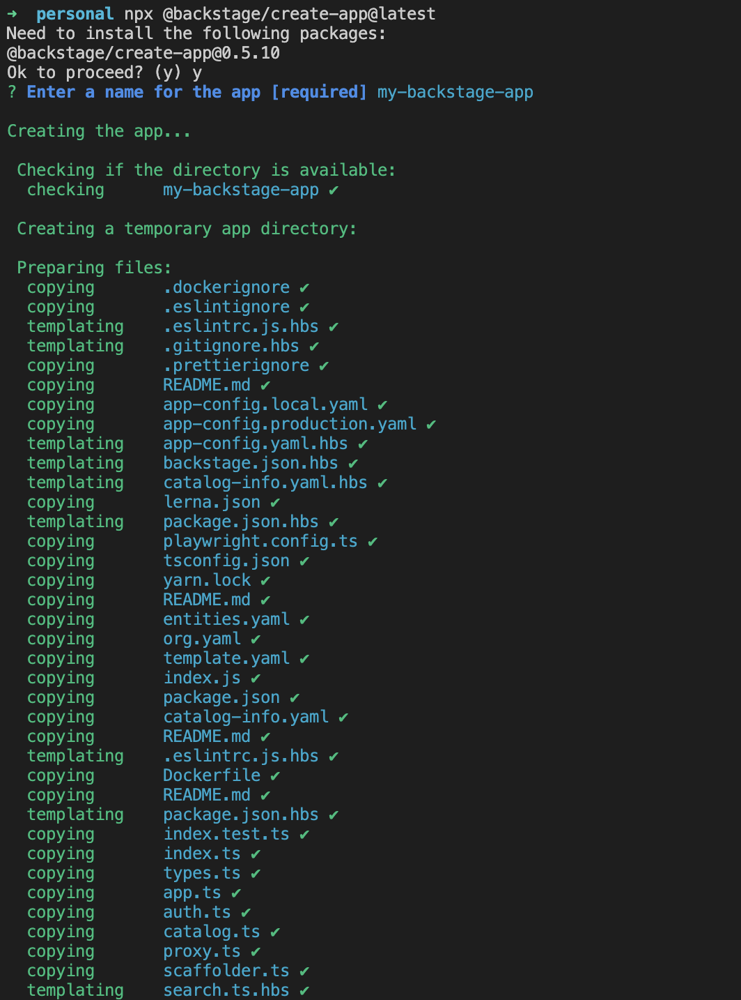

# Backstage Onboarding

## Description

- This is the onboarding document for the Backstage project.
- Backstage is a developer portal that lets you monitor different aspects of development.
- Our goal is to get backstage running locally in container.

## Resources Collection

If you want to learn more before starting with Backstage, Check out the resources from the list below!

[Backstage demo page](https://demo.backstage.io/home)

[Backstage docs](https://backstage.io/docs/overview/what-is-backstage)

[Backstage Introduction Video](https://www.youtube.com/playlist?list=PLGVPcLSzJXQos1O18dvKoW2XSczz2I2lH)

## Backstage installation prerequisite

- `curl` , `wget`
- `Rancher desktop`  [Installation](https://github.com/rancher-sandbox/rancher-desktop/releases)
( If Docker is already installed due to licensing issues, uninstall the existing Docker and install Rancher Desktop.)
- `yarn` [Installation](https://classic.yarnpkg.com/en/docs/install)
- `git` [Installation](https://github.com/git-guides/install-git)
- Node.js [Active LTS Release](https://nodejs.org/en/about/previous-releases) installed using one of these methods:
    - Using `nvm` (recommended)
        - [Installing nvm](https://github.com/nvm-sh/nvm#install--update-script)
        - [Install and change Node version with nvm](https://nodejs.org/en/download/package-manager/#nvm)
    - [Binary Download](https://nodejs.org/en/download/)
    - [Package manager](https://nodejs.org/en/download/package-manager/)
    - [Using NodeSource packages](https://github.com/nodesource/distributions/blob/master/README.md)
- Python [Installation](https://www.python.org/downloads/), Pip

### npm Installation

(Mac OS)

```jsx
# installs NVM (Node Version Manager)
curl -o- https://raw.githubusercontent.com/nvm-sh/nvm/v0.39.7/install.sh | bash

# download and install Node.js
nvm install 20

# verifies the right Node.js version is in the environment
node -v # should print `v20.12.2`

# verifies the right NPM version is in the environment
npm -v # should print `10.5.0`
```

(Window Powershell)

```jsx
npm install npm
npm install npx
```

### yarn Installation

```jsx
npm install --global yarn

#Check that Yarn is installed by running:
yarn --version
```

### Python Installation (macOS)

If you're a Mac user, you might have Python already installed. You can check by running

```jsx
python3 --version

```

### Pip installation

but pip is not included by default. So, you’ll need to install pip separately.

1. First, download the **`get-pip.py`** script from the following link:
[https://bootstrap.pypa.io/get-pip.py](https://bootstrap.pypa.io/get-pip.py)
2. Open Terminal and navigate to the directory where you downloaded the **`get-pip.py`** script.
3. Run the following command to install pip:
    
    ```
    python get-pip.py
    pip3 --version
    ```
    

Now, pip is installed, and you can easily manage and install Python packages.

## Installing a standalone server

This is the official documentation for setting up a local backstage app.

[Installing a standalone server | Backstage Software Catalog and Developer Platform](https://backstage.io/docs/getting-started/)

Then you can create the backstage the backstage standalone app:

```jsx
npx @backstage/create-app@latest
```

The console will then prompt you to enter a name for your app.

This may take a few minutes to fully install everything.

This will create a folder with that name, which you can open with your IDE of choice. 



To run the application enter the below command in the terminal:

```jsx
cd my-backstage-app # your app name
yarn dev
```